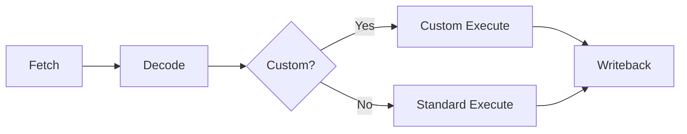

## Overview

Kanagawa's RISC-V core can be extended with custom instructions, allowing you to add domain-specific accelerators directly into the processor pipeline. This example shows how to decode and execute custom operations.

## Architecture

Custom instructions are integrated into the RISC-V pipeline through callbacks:



## Simple Custom Instruction

Let's add a population count (popcount) instruction:

```kanagawa custom_popcount.k
import processor.risc_v
import base

// RISC-V core with custom popcount instruction
class CustomRISCV
{
private:
    const auto IMEM_SIZE = 0x1000;
    const auto DMEM_SIZE = 0x2000;
    
    // Custom opcode definitions
    const auto CUSTOM_OPCODE = 0x0B;  // custom-0 opcode space
    const auto FUNCT3_POPCOUNT = 0x0;
    const auto FUNCT7_POPCOUNT = 0x20;

public:
    // Decode custom instructions
    inline optional<uint32> decode_custom(uint32 instruction)
    {
        optional<uint32> result = {};
        
        // Extract fields
        uint7 opcode = static_cast<uint7>(instruction & 0x7F);
        uint3 funct3 = static_cast<uint3>((instruction >> 12) & 0x7);
        uint7 funct7 = static_cast<uint7>((instruction >> 25) & 0x7F);
        
        if (opcode == CUSTOM_OPCODE &&
            funct3 == FUNCT3_POPCOUNT &&
            funct7 == FUNCT7_POPCOUNT)
        {
            result.is_valid = true;
            result.value = 1;  // Custom instruction ID
        }
        
        return result;
    }
    
    // Execute custom instructions
    inline int32 execute_custom(
        uint32 custom_id,
        int32 rs1_value,
        int32 rs2_value
    )
    {
        int32 result = 0;
        
        if (custom_id == 1)  // Popcount
        {
            // Count number of 1 bits in rs1
            uint32 value = static_cast<uint32>(rs1_value);
            uint6 count = 0;
            
            static for (const auto i : 32)
            {
                count += static_cast<uint6>((value >> i) & 1);
            }
            
            result = static_cast<int32>(count);
        }
        
        return result;
    }

private:
    using processor_t = RISC_V<
        1,
        IMEM_SIZE,
        DMEM_SIZE
    >;
    
    // Initialize processor with custom instruction callbacks
    processor_t _cpu = {
        .decode_custom = decode_custom,
        .execute_custom = execute_custom
    };

public:
    void start(uint32 pc_offset)
    {
        uint32[1] pc = {pc_offset};
        _cpu.start(pc);
    }
}

export CustomRISCV;
```

## Understanding Custom Instructions

<Steps>
  <Step title="Choose instruction encoding">
    RISC-V provides several custom opcode spaces:

    - `custom-0`: 0x0B
    - `custom-1`: 0x2B
    - `custom-2`: 0x5B
    - `custom-3`: 0x7B

    ```kanagawa
    const auto CUSTOM_OPCODE = 0x0B;  // Use custom-0 space
    ```

    <Info>
      Use `funct3` and `funct7` fields to distinguish between multiple custom instructions in the same opcode space.
    </Info>
  </Step>

  <Step title="Implement decode callback">
    The decode callback examines the instruction encoding:

    ```kanagawa
    inline optional<uint32> decode_custom(uint32 instruction)
    {
        optional<uint32> result = {};
        
        uint7 opcode = instruction & 0x7F;
        
        if (opcode == CUSTOM_OPCODE)
        {
            result.is_valid = true;
            result.value = extract_custom_id(instruction);
        }
        
        return result;
    }
    ```

    Return empty optional if instruction is not custom.
  </Step>

  <Step title="Implement execute callback">
    The execute callback performs the custom operation:

    ```kanagawa
    inline int32 execute_custom(
        uint32 custom_id,
        int32 rs1_value,      // Source register 1
        int32 rs2_value       // Source register 2
    )
    {
        // Perform custom computation
        return rs1_value + rs2_value;
    }
    ```

    The result is written back to the destination register.
  </Step>

  <Step title="Connect callbacks to processor">
    Initialize the processor with callback functions:

    ```kanagawa
    processor_t _cpu = {
        .decode_custom = decode_custom,
        .execute_custom = execute_custom
    };
    ```
  </Step>
</Steps>

## Advanced Example: Crypto Instructions

Add AES S-box and bitwise rotation instructions:

```kanagawa custom_crypto.k
import processor.risc_v
import base

class CryptoRISCV
{
private:
    const auto CUSTOM_OPCODE = 0x0B;
    
    // Custom instruction IDs
    const auto INSN_AES_SBOX = 1;
    const auto INSN_ROL = 2;
    const auto INSN_ROR = 3;
    const auto INSN_BREV = 4;  // Bit reverse
    
    // AES S-box lookup table
    inline uint8[256] generate_sbox()
    {
        uint8[256] sbox;
        // Generate AES S-box (simplified)
        static for (const auto i : 256)
        {
            uint8 x = i;
            // Apply affine transformation
            x = galois_inverse(x);
            x = affine_transform(x);
            sbox[i] = x;
        }
        return sbox;
    }
    
    inline uint8 galois_inverse(uint8 x)
    {
        if (x == 0) return 0;
        
        // Simplified GF(2^8) multiplicative inverse
        uint8 result = 1;
        uint8 temp = x;
        
        // Power to 254 in GF(2^8)
        static for (const auto i : 7)
        {
            temp = galois_multiply(temp, temp);
            if (i == 1 || i == 2 || i == 3 || i == 4 || i == 6)
            {
                result = galois_multiply(result, temp);
            }
        }
        
        return result;
    }
    
    inline uint8 galois_multiply(uint8 a, uint8 b)
    {
        uint8 p = 0;
        static for (const auto i : 8)
        {
            if ((b & 1) != 0)
            {
                p ^= a;
            }
            bool carry = (a & 0x80) != 0;
            a <<= 1;
            if (carry)
            {
                a ^= 0x1B;  // AES polynomial
            }
            b >>= 1;
        }
        return p;
    }
    
    inline uint8 affine_transform(uint8 x)
    {
        uint8 result = x;
        result ^= (x << 1) | (x >> 7);
        result ^= (x << 2) | (x >> 6);
        result ^= (x << 3) | (x >> 5);
        result ^= (x << 4) | (x >> 4);
        result ^= 0x63;
        return result;
    }
    
    const uint8[256] _sbox = generate_sbox();

public:
    inline optional<uint32> decode_custom(uint32 instruction)
    {
        optional<uint32> result = {};
        
        uint7 opcode = instruction & 0x7F;
        uint3 funct3 = (instruction >> 12) & 0x7;
        uint7 funct7 = (instruction >> 25) & 0x7F;
        
        if (opcode == CUSTOM_OPCODE)
        {
            result.is_valid = true;
            
            // Decode based on funct3/funct7
            if (funct3 == 0 && funct7 == 0x20)
            {
                result.value = INSN_AES_SBOX;
            }
            else if (funct3 == 1 && funct7 == 0x20)
            {
                result.value = INSN_ROL;
            }
            else if (funct3 == 2 && funct7 == 0x20)
            {
                result.value = INSN_ROR;
            }
            else if (funct3 == 3 && funct7 == 0x20)
            {
                result.value = INSN_BREV;
            }
        }
        
        return result;
    }
    
    inline int32 execute_custom(
        uint32 custom_id,
        int32 rs1_value,
        int32 rs2_value
    )
    {
        int32 result = 0;
        
        if (custom_id == INSN_AES_SBOX)
        {
            // Apply S-box to each byte
            uint32 input = static_cast<uint32>(rs1_value);
            uint8 b0 = _sbox[static_cast<uint8>(input)];
            uint8 b1 = _sbox[static_cast<uint8>(input >> 8)];
            uint8 b2 = _sbox[static_cast<uint8>(input >> 16)];
            uint8 b3 = _sbox[static_cast<uint8>(input >> 24)];
            result = static_cast<int32>(concat(b3, b2, b1, b0));
        }
        else if (custom_id == INSN_ROL)
        {
            // Rotate left by rs2 bits
            uint32 val = static_cast<uint32>(rs1_value);
            uint5 shift = static_cast<uint5>(rs2_value & 0x1F);
            result = static_cast<int32>((val << shift) | (val >> (32 - shift)));
        }
        else if (custom_id == INSN_ROR)
        {
            // Rotate right by rs2 bits
            uint32 val = static_cast<uint32>(rs1_value);
            uint5 shift = static_cast<uint5>(rs2_value & 0x1F);
            result = static_cast<int32>((val >> shift) | (val << (32 - shift)));
        }
        else if (custom_id == INSN_BREV)
        {
            // Reverse bits
            uint32 input = static_cast<uint32>(rs1_value);
            uint32 output = 0;
            static for (const auto i : 32)
            {
                output |= ((input >> i) & 1) << (31 - i);
            }
            result = static_cast<int32>(output);
        }
        
        return result;
    }

private:
    using processor_t = RISC_V<
        1,
        0x10000,
        0x20000
    >;
    
    processor_t _cpu = {
        .decode_custom = decode_custom,
        .execute_custom = execute_custom
    };

public:
    void start(uint32 pc_offset)
    {
        uint32[1] pc = {pc_offset};
        _cpu.start(pc);
    }
}

export CryptoRISCV;
```

## Writing Software to Use Custom Instructions

Create inline assembly macros in C:

```c
#define CUSTOM_POPCOUNT(rd, rs1) \
    asm volatile ( \
        ".insn r 0x0B, 0x0, 0x20, %0, %1, x0" \
        : "=r"(rd) \
        : "r"(rs1) \
    )

// Usage
uint32_t count_bits(uint32_t value) {
    uint32_t result;
    CUSTOM_POPCOUNT(result, value);
    return result;
}
```

Or use GCC's inline assembly:

```c
static inline uint32_t aes_sbox(uint32_t value) {
    uint32_t result;
    asm volatile (
        ".insn r 0x0B, 0x0, 0x20, %0, %1, x0"
        : "=r"(result)
        : "r"(value)
    );
    return result;
}

static inline uint32_t rotate_left(uint32_t value, uint32_t shift) {
    uint32_t result;
    asm volatile (
        ".insn r 0x0B, 0x1, 0x20, %0, %1, %2"
        : "=r"(result)
        : "r"(value), "r"(shift)
    );
    return result;
}
```

## Complex Multi-Cycle Instructions

For operations that take multiple cycles:

```kanagawa custom_multicycle.k
import processor.risc_v
import base

class MultiCycleCustom
{
private:
    // State for multi-cycle instruction
    struct custom_state_t
    {
        bool active;
        uint5 cycle_count;
        int32 accumulator;
    }
    
    custom_state_t[8] _custom_state = {};  // One per hart

public:
    inline optional<int32> execute_custom_multicycle(
        processor_t::hart_index_t hart_id,
        uint32 custom_id,
        int32 rs1_value,
        int32 rs2_value
    )
    {
        optional<int32> result = {};
        
        if (custom_id == INSN_MATRIX_MAC)  // Matrix multiply-accumulate
        {
            if (!_custom_state[hart_id].active)
            {
                // Start operation
                _custom_state[hart_id].active = true;
                _custom_state[hart_id].cycle_count = 0;
                _custom_state[hart_id].accumulator = 0;
            }
            
            // Perform one step
            _custom_state[hart_id].accumulator += rs1_value * rs2_value;
            _custom_state[hart_id].cycle_count++;
            
            // Check if complete
            if (_custom_state[hart_id].cycle_count >= 16)
            {
                result.is_valid = true;
                result.value = _custom_state[hart_id].accumulator;
                _custom_state[hart_id].active = false;
            }
        }
        
        return result;
    }
}
```

<Warning>
  Multi-cycle instructions can stall the pipeline. Use them judiciously or consider making them asynchronous.
</Warning>

## Performance Impact

<AccordionGroup>
  <Accordion title="Single-Cycle Instructions">
    Custom instructions that execute in one cycle integrate seamlessly:
    
    - No pipeline stalls
    - Same throughput as native instructions
    - Minimal area overhead
    
    Best for: Bit manipulation, LUT operations, simple arithmetic
  </Accordion>

  <Accordion title="Multi-Cycle Instructions">
    Instructions taking multiple cycles can stall the pipeline:
    
    - Pipeline stalls until completion
    - Reduced throughput for hart
    - May impact other harts depending on configuration
    
    Best for: Complex operations that would otherwise require many instructions
  </Accordion>

  <Accordion title="Memory-Based Instructions">
    Instructions that access memory have additional considerations:
    
    - Must coordinate with memory subsystem
    - May experience variable latency
    - Consider using MMIO instead
    
    Best for: Access to specialized accelerators
  </Accordion>
</AccordionGroup>

## Testing Custom Instructions

```kanagawa test_custom.k
import base
import test.unit as unit
import test.runner

inline void PopcountTest(unit::tag_t tag)
{
    // Test the custom popcount instruction
    uint32 test_value = 0b10101010101010101010101010101010;
    
    // Expected: 16 bits set
    uint32 result = custom_popcount(test_value);
    
    unit::assert_equal(tag, 16, result);
}

inline void RotateTest(unit::tag_t tag)
{
    uint32 value = 0x12345678;
    uint32 rotated = custom_rol(value, 8);
    
    unit::assert_equal(tag, 0x34567812, rotated);
}

inline void test_main()
{
    unit::test<1>(PopcountTest);
    unit::test<2>(RotateTest);
}
```

## Key Takeaways

<CardGroup cols={2}>
  <Card title="Instruction Encoding" icon="binary">
    Use RISC-V custom opcode spaces (0x0B, 0x2B, 0x5B, 0x7B)
  </Card>
  
  <Card title="Decode Callback" icon="magnifying-glass">
    Identify custom instructions and return instruction ID
  </Card>
  
  <Card title="Execute Callback" icon="play">
    Implement custom operation using source register values
  </Card>
  
  <Card title="Performance" icon="gauge">
    Single-cycle instructions integrate seamlessly; multi-cycle may stall
  </Card>
</CardGroup>

## Further Reading

<CardGroup cols={2}>
  <Card title="RISC-V ISA Manual" icon="book" href="https://riscv.org/technical/specifications/">
    Official RISC-V instruction set documentation
  </Card>
  
  <Card title="Programming Guide" icon="code" href="/programming-guide/advanced-features">
    Advanced Kanagawa language features
  </Card>
  
  <Card title="Processor Module" icon="microchip" href="/api-reference/library/processor">
    Complete processor.risc_v API reference
  </Card>
</CardGroup>
